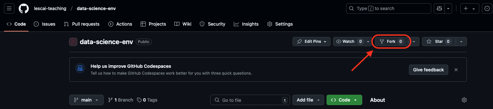

# Data Science Environment

Jupyter environment for the course "Data Science in Everyday Practice"

## GitHub CodeSpaces

### 1. Pre-requirements

In order to make the CodeSpace work, you should have a GitHub account: if you don't have one, sign up to GitHub [here](https://github.com/signup).

### 2. Fork the environment in your user space

In order to be able to write files, take notes and modify the environment, you should first copy this repository under your own user. 
This operation is called "fork": it is sufficient to click the fork button on the top right of the repository main page, and select to fork it under your user.

### 3. Launch the Space

Click the  `<> Code` button on the top right, selecting `Codespaces` and then `Create codespace on main`, as you can see in the animation here:

### 4. Open in JupyterLab

Once the space has been created, to make it work properly you should:

1. Close the browser window
2. Go back to the repository page
3. Click the  `<> Code` button on the top right, selecting `Codespaces`
4. Select the space you have just created, click on `...` and then on `Open in JupyterLab`

And you're done! A JupyterLab interface should open soon, from which you'll be able to click on the `RStudio` icon and start working with RStudio😁. See the video down here:

